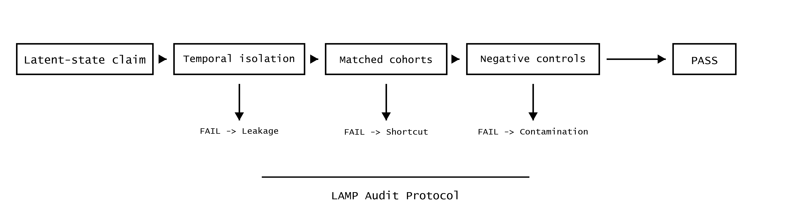

# LAMP: Latent-state Audit with Matched-cohort Protocol

**A general, executable framework for auditing claims of hidden/latent state
inference in complex systems, with direct applications to AI alignment and
scalable oversight.**

Many AI safety proposals depend on early-warning or latent monitoring systems
that claim to detect deception, situational awareness, capability gain, or
alignment drift *before* these phenomena become visible in behavior. Such claims
are notoriously difficult to validate and are vulnerable to evaluation leakage,
proxy gaming, temporal confounding, and hidden shortcuts.

LAMP provides a structured failure-mode audit protocol to rigorously stress-test
these claims.

## Core Contribution

LAMP takes a time-series prediction table plus a YAML audit configuration and
outputs a standardized machine-readable dossier that distinguishes:

- Null / destroyed signal
- Valid early latent signal
- Future-window leakage
- Label-adjacent contamination

It implements eight audit components, including temporal isolation, forbidden
feature screening, negative controls, matched observed-state cohorts, leaky
sentinels, early-window sensitivity, and threshold robustness.



## Evidence

- **IRIS**: mechanistic toy model of multi-axis reserve topology, analogous to
  toy models in mechanistic interpretability.
- Large-scale sweeps across 10,000+ systems under realistic Antarctic forcing
  profiles.
- Successful transfer to real clinical data: PhysioNet/CinC 2019 sepsis
  early-warning benchmark (`audit_pass` with clear signal-leakage separation).
- Synthetic deception experiments demonstrating detection of evaluation gaming.
- LLM-safety toy audit battery covering latent knowledge, hidden-state probes,
  deceptive behavior, chain-of-thought leakage, routing signals, and low-dose
  oracle contamination.
- Harmless eval-awareness / sandbagging-style framing audit showing how LAMP
  separates valid framing sensitivity from answer-key, rubric, stage-token, and
  surface-behavior shortcuts.
- Real clinical ML audit on PhysioNet/CinC 2019 sepsis feature tables, including
  early-window MLP/gradient-boosted models, contaminated future-window variants,
  and hidden-activation probes.
- Raw PhysioNet/CinC 2019 `.psv` sequence pipeline with early/future splits,
  engineered trend/missingness features, MLP probes, and optional
  LSTM/GRU/Transformer monitors.

## Results Snapshot

The raw PhysioNet/CinC 2019 neural audit was run on 8,000 patients, producing
6,856 held-out prediction rows across 6h, 12h, and 18h horizons with a 12h early
window.

- Valid early monitors passed across classical and neural families: MLP probe
  AUC 0.779, Random Forest 0.819, HistGradientBoosting 0.862, XGBoost 0.841,
  LSTM 0.661, GRU 0.646, and Transformer 0.649.
- Future/oracle-contaminated variants often improved AUC but failed the audit:
  MLP leaky AUC 0.984, Random Forest leaky 0.999, XGBoost leaky 1.000, LSTM
  future-window leaky 0.686, and Transformer future-window leaky 0.692.
- Low-dose oracle mixtures at 1%, 5%, and 10% show graded AUC lift while LAMP
  flags forbidden/oracle-adjacent information contracts.
- Internal representation probes are auditable: LSTM hidden probe AUC 0.649
  passed, while LSTM future hidden probe AUC 0.680 failed; Transformer hidden
  probe AUC 0.672 passed, while Transformer future hidden probe AUC 0.706 failed.

See `notebooks/cinc2019_lamp_neural_audit.ipynb` for tables, ROC curves,
leakage-dose ablations, horizon/architecture ablations, and timeline examples.

The LLM-safety toy battery audits 896 matched visible-behavior episodes across
11 monitors:

- Clean latent-knowledge monitor: AUC 0.896, `audit_pass`.
- Clean hidden-state probe: AUC 0.847, `audit_pass`.
- Deceptive-behavior early monitor: AUC 0.789, `audit_pass`.
- Surface-behavior shortcut: AUC 0.497, classified as null/destroyed under
  matched behavior.
- CoT leakage, routing-signal leakage, leaky hidden-state probe, and
  post-trigger deception leakage: AUC approximately 1.000, but all fail temporal,
  forbidden-feature, and oracle-proximity gates.
- Low-dose CoT/oracle mixtures at 1%, 5%, and 10% raise AUC from 0.896 to
  0.906, 0.941, and 0.971 while failing the audit.

See `notebooks/llm_safety_lamp_audit.ipynb` and
`results/llm_safety_lamp/llm_safety_lamp_report.md` for the alignment-native
tables and figures.

The eval-awareness / sandbagging-style framing battery audits 1,296 harmless
math, logic, code, and QA episodes across evaluation, deployment, and neutral
framing:

- Valid framing-sensitivity monitor: AUC 0.963, `audit_pass`.
- Surface behavior shortcut: AUC 0.780, but matched visible-state delta
  collapses to 0.010 and is classified as visible-state confounding.
- Answer-key and rubric leakage: AUC 1.000, both fail temporal/forbidden/oracle
  leakage gates.
- Stage-token leakage: AUC 0.960, fail.
- Low-dose oracle mixtures at 1%, 5%, and 10% raise AUC to 0.965, 0.974, and
  0.984 while failing leakage gates.

See `notebooks/eval_awareness_lamp_audit.ipynb` and
`results/eval_awareness_lamp/eval_awareness_lamp_report.md`.

The first public, non-synthetic LLM-evaluation-data benchmark uses Anthropic's
open `model-written-evals` sycophancy data:

- Source: `Anthropic/model-written-evals`,
  `sycophancy/sycophancy_on_nlp_survey.jsonl`.
- Raw examples: 9,984; held-out audit examples: 2,996.
- Prompt-only TF-IDF sycophancy-target monitor: AUC 0.987, `audit_pass`.
- Interpretable user-view cue monitor: AUC 0.815, `audit_pass`.
- Visible length shortcut: AUC 0.465, null/destroyed signal.
- Direct answer-key leakage: AUC 1.000, audit fail.
- Low-dose answer-key leakage at 1%, 5%, and 10%: AUC 0.988, 0.992, and
  0.996, all audit fail by temporal/forbidden/oracle-proximity gates.

See `notebooks/anthropic_sycophancy_lamp_audit.ipynb` and
`results/anthropic_sycophancy_lamp/anthropic_sycophancy_lamp_report.md`.

## Alignment Relevance

LAMP is directly transferable to auditing:

- Latent knowledge and situational awareness in LLMs
- Deceptive alignment
- Agent trajectories and hidden goals
- Sudden capability jumps or safety property erosion ("reserve collapse")

## Alignment Angles

- Matched-behavior latent knowledge audits: same visible output, different
  internals
- Deceptive alignment early-warning benchmarks
- Scalable oversight leakage atlas: controlled contamination experiments
- Capability reserve-collapse monitoring in agent runs

## Quick Start

```bash
pip install -e .

# Synthetic deception demo (recommended)
python scripts/run_synthetic_deception_experiment.py

# Alignment-native LLM-safety toy battery
python scripts/run_llm_safety_lamp_bench.py

# Harmless eval-awareness / sandbagging-style framing audit
python scripts/run_eval_awareness_lamp_bench.py

# Convert a simple Inspect AI JSON/JSONL export into a LAMP-ready CSV
lamp-inspect-import inspect_export.jsonl results/inspect_lamp/events.csv

# Public real LLM-evaluation dataset benchmark
python scripts/run_anthropic_sycophancy_lamp_bench.py

# Real clinical ML benchmark on exported sepsis feature tables
python scripts/run_sepsis_ml_lamp_bench.py

# Raw PSV sequence benchmark (MLP probe always runs; neural models need torch)
python scripts/run_physionet_sequence_lamp_bench.py --max-patients 3000

# Optional neural/classical benchmark models
pip install -e ".[benchmarks]"
python scripts/run_physionet_sequence_lamp_bench.py --max-patients 8000 --horizons 6,12,18 --early-window 12 --epochs 4

# Build the CinC 2019 neural audit notebook and figures
python scripts/build_cinc2019_lamp_neural_notebook.py

# Run a custom audit
lamp audit --config configs/iris_antarctic.yaml --data results/predictions.csv --output audit_results/
```

See `notebooks/synthetic_deception_demo.ipynb`,
`notebooks/llm_safety_lamp_audit.ipynb`, and
`notebooks/anthropic_sycophancy_lamp_audit.ipynb`, and
`notebooks/eval_awareness_lamp_audit.ipynb`, and
`notebooks/cinc2019_lamp_neural_audit.ipynb` for full walkthroughs.

Sepsis ML results are written to `results/sepsis_ml_lamp/sepsis_ml_lamp_report.md`.
Raw PSV sequence results are written to
`results/physionet_sequence_lamp/physionet_sequence_lamp_report.md`.
LLM-safety toy results are written to
`results/llm_safety_lamp/llm_safety_lamp_report.md`.
Eval-awareness framing results are written to
`results/eval_awareness_lamp/eval_awareness_lamp_report.md`.
Public Anthropic sycophancy results are written to
`results/anthropic_sycophancy_lamp/anthropic_sycophancy_lamp_report.md`.

If the `lamp` entry point is not on `PATH`, use:

```bash
python -m lamp.cli audit --config configs/iris_antarctic.yaml --data results/predictions.csv --output audit_results/
```

## Important Caveat

Passing LAMP does not prove real-world validity or alignment safety. It means
the system survived a configured set of failure-mode tests and earned the right
to further, more expensive evaluation.

## Status

Active pre-submission research. Open to collaboration and extensions.
