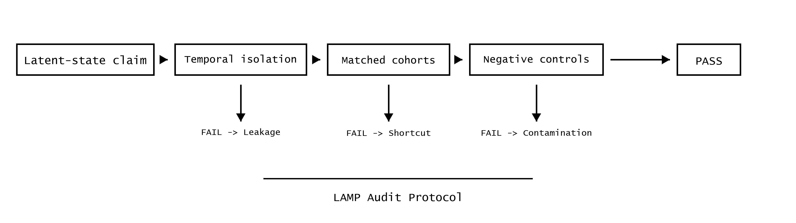

# LAMP: Latent-state Audit with Matched-cohort Protocol

**A general, executable framework for auditing claims of hidden/latent state
inference in complex systems, with direct applications to AI alignment and
scalable oversight.**

Many AI safety proposals depend on early-warning or latent monitoring systems
that claim to detect deception, situational awareness, capability gain, or
alignment drift *before* these phenomena become visible in behavior. Such claims
are notoriously difficult to validate and are vulnerable to evaluation leakage,
proxy gaming, temporal confounding, and hidden shortcuts.

LAMP provides a structured failure-mode audit protocol to rigorously stress-test
these claims.

## Core Contribution

LAMP takes a time-series prediction table plus a YAML audit configuration and
outputs a standardized machine-readable dossier that distinguishes:

- Null / destroyed signal
- Valid early latent signal
- Future-window leakage
- Label-adjacent contamination

It implements eight audit components, including temporal isolation, forbidden
feature screening, negative controls, matched observed-state cohorts, leaky
sentinels, early-window sensitivity, and threshold robustness.



## Evidence

- **IRIS**: mechanistic toy model of multi-axis reserve topology, analogous to
  toy models in mechanistic interpretability.
- Large-scale sweeps across 10,000+ systems under realistic Antarctic forcing
  profiles.
- Successful transfer to real clinical data: PhysioNet/CinC 2019 sepsis
  early-warning benchmark (`audit_pass` with clear signal-leakage separation).
- Synthetic deception experiments demonstrating detection of evaluation gaming.
- LLM-safety toy audit battery covering latent knowledge, hidden-state probes,
  deceptive behavior, chain-of-thought leakage, routing signals, and low-dose
  oracle contamination.
- Harmless eval-awareness / sandbagging-style framing audit showing how LAMP
  separates valid framing sensitivity from answer-key, rubric, stage-token, and
  surface-behavior shortcuts.
- Real clinical ML audit on PhysioNet/CinC 2019 sepsis feature tables, including
  early-window MLP/gradient-boosted models, contaminated future-window variants,
  and hidden-activation probes.
- Raw PhysioNet/CinC 2019 `.psv` sequence pipeline with early/future splits,
  engineered trend/missingness features, MLP probes, and optional
  LSTM/GRU/Transformer monitors.
- Known-truth oracle-injection control on real PhysioNet/CinC 2019 sepsis rows:
  0.5% injected oracle label leakage keeps AUC deltas below 0.01 across 6h,
  12h, and 18h horizons while LAMP fails the contaminated monitors.

## Results Snapshot

The raw PhysioNet/CinC 2019 neural audit was run on 8,000 patients, producing
6,856 held-out prediction rows across 6h, 12h, and 18h horizons with a 12h early
window.

- Valid early monitors passed across classical and neural families: MLP probe
  AUC 0.779, Random Forest 0.819, HistGradientBoosting 0.862, XGBoost 0.841,
  LSTM 0.661, GRU 0.646, and Transformer 0.649.
- Future/oracle-contaminated variants often improved AUC but failed the audit:
  MLP leaky AUC 0.984, Random Forest leaky 0.999, XGBoost leaky 1.000, LSTM
  future-window leaky 0.686, and Transformer future-window leaky 0.692.
- Low-dose oracle mixtures at 1%, 5%, and 10% show graded AUC lift while LAMP
  flags forbidden/oracle-adjacent information contracts.
- A controlled synthetic metric-blind leakage experiment shows the same pattern
  without a clinical dataset: the first nonzero oracle dose breaks the declared
  information contract even when the AUC movement remains below a simple
  0.01-delta metric alert.
- NASA C-MAPSS FD001 adds a physical degradation control: valid current-cycle
  monitors pass (HGB AUC 0.902, RF AUC 0.907), while 0.1% true-RUL oracle
  contamination moves AUC by only 0.0004 and is not significant by incremental
  MI bootstrap (p=0.096), yet fails the information-contract audit.
- A pair of public LAMP-Bio iPSC-CM maturation artifacts converts biological
  hidden-state claims into audit objects: GEO `GSE209997` separates maturation
  markers from timepoint/3D-protocol shortcuts, while GEO `GSE201437` exposes
  high-calcium and ramp-pacing intervention shortcuts around an HCRP maturation
  claim.
- A controlled GSE201437 separation sanity check shows LAMP can return PASS on
  biological expression rows: clean disjoint maturation probe PASS (AUC 0.694),
  high-calcium protocol shortcut FAIL (AUC 0.857), and oracle leakage FAIL
  (AUC 1.000).
- Robustness checks on that GSE201437 sanity PASS show the correct caution:
  clean bootstrap PASS rate is 0.503 over 300 stratified resamples, 4/5
  alternative disjoint probe panels pass, and shortcut/leakage rejection remains
  stable at 1.000 expected-decision rate.
- The iPSC-CM biological contract layer maps raw LAMP outputs into maturation
  interpretation levels: clean GSE201437 probe -> `valid_biological_signal_fragile`,
  high-calcium shortcut -> `protocol_confounded_signal`, oracle leakage ->
  `endpoint_adjacent_contamination`.
- A synthetic iPSC molecular-code control adds a hybrid kinase/protein-folding
  contract: clean early kinase/proteostasis monitor PASS (AUC 0.914), kinase-only
  probe PASS but `valid_biological_signal_fragile` (AUC 0.906), protocol/stressor
  shortcut FAIL despite usable AUC 0.663, future folding leakage FAIL (AUC
  0.957), oracle leakage FAIL (AUC 1.000), and 0.5% oracle contamination changes
  AUC only from 0.914 to 0.916 while failing the declared information contract.
- LAMP-Discovery turns those audits into localized hypotheses and experiment
  sketches: clean hybrid -> candidate latent-state signal localized to
  `early_mapk_phospho_slope`; protocol shortcut -> balanced donor/batch/protocol
  plate design; future folding leakage -> time-lagged kinase-to-folding
  hypothesis with 15/30/60/120 minute readouts.
- The molecular-code leakage analysis adds ROC overlays, a known-truth confusion
  matrix, and lambda sensitivity: clean AUC 0.9141 vs 0.5% oracle mix AUC
  0.9159 (delta 0.0018); canonical synthetic LAMP decisions reach sensitivity
  1.000 and specificity 1.000; strict declared-provenance mode detects the
  lowest tested leakage dose (0.001%), while geometry-only proximity detects
  from 0.05%.
- The real PhysioNet/CinC 2019 known-truth oracle-injection control reproduces
  the same pattern on clinical rows: at 0.5% injected oracle leakage, AUC deltas
  are 0.0078, 0.0083, and 0.0087 for 6h/12h/18h horizons, all below a 0.01
  metric-delta alert; clean-vs-0.5% LAMP decisions give sensitivity 1.000 and
  specificity 1.000 in both strict-declared and geometry-only modes.
- A first LAMP-Pharm public artifact on GEO `GSE114686` asks whether a
  hiPSC-CM cardiotoxicity monitor detects pharmacological response biology or
  experimental structure; drug identity and dose sentinels outperform a modest
  signed stress/cardiac-program biology panel.
- Internal representation probes are auditable: LSTM hidden probe AUC 0.649
  passed, while LSTM future hidden probe AUC 0.680 failed; Transformer hidden
  probe AUC 0.672 passed, while Transformer future hidden probe AUC 0.706 failed.

See `notebooks/cinc2019_lamp_neural_audit.ipynb` for tables, ROC curves,
leakage-dose ablations, horizon/architecture ablations, and timeline examples.
See `results/metric_blind_leakage_control/metric_blind_leakage_report.md` for
the synthetic control.
See `results/cmapss_lamp/cmapss_lamp_report.md` for the NASA C-MAPSS physical
degradation control.
See
`results/ipsc_cm_maturation_lamp/gse209997_micro/gse209997_micro_lamp_report.md`
for the first iPSC-CM maturation audit artifact. This is intentionally a
12-sample public-data smoke test, not a benchmark-level biological claim; the
important result is the protocol/timepoint/leaky-marker separation pattern.
See
`results/ipsc_cm_maturation_lamp/gse201437_protocol_shortcut/gse201437_protocol_shortcut_lamp_report.md`
for the LAMP-Bio protocol-shortcut artifact on high-calcium/ramp-pacing iPSC-CM
maturation.
See `results/ipsc_cm_maturation_lamp/lamp_bio_summary.md` for the two-artifact
LAMP-Bio summary.
See `configs/ipsc_cm_maturation_contract.yaml`,
`docs/ipsc_cm_maturation_contract.md`, and
`results/ipsc_cm_maturation_lamp/bio_contract_diagnosis/ipsc_cm_bio_contract_diagnosis.md`
for the biological interpretation contract.
See `configs/ipsc_molecular_code_contract.yaml`,
`docs/ipsc_molecular_code_contract.md`, and
`results/ipsc_molecular_code/synthetic_kinase_folding/synthetic_ipsc_molecular_code_report.md`
for the kinase/phosphosignaling plus protein-folding molecular-code control.
See `docs/lamp_discovery.md` and
`results/ipsc_molecular_code/synthetic_kinase_folding/synthetic_ipsc_molecular_code_discovery_report.md`
for the first discovery-oriented emulator artifact.
See
`results/ipsc_molecular_code/synthetic_kinase_folding/leakage_sensitivity/ipsc_molecular_code_leakage_analysis_report.md`
and the PNG figures in
`results/ipsc_molecular_code/synthetic_kinase_folding/leakage_sensitivity/figures/`
for ROC overlap, confusion matrix, and leakage-dose sensitivity.
See
`results/physionet_sepsis_oracle_injection/real_physionet_oracle_injection_report.md`
and the PNG figures in `results/physionet_sepsis_oracle_injection/figures/`
for the real-data known-truth oracle-injection control.
See
`results/lamp_pharm/gse114686_tki_cardiotoxicity/gse114686_lamp_pharm_report.md`
and `results/lamp_pharm/lamp_pharm_summary.md` for the first LAMP-Pharm
cardiotoxicity shortcut audit.
See `paper/metric_blind_leakage_preprint.md` for the short metric-blind leakage
preprint draft and `results/metric_blind_preprint/preprint_extra_rows.csv` for
the real-domain lambda=0.001 table rows.

The LLM-safety toy battery audits 896 matched visible-behavior episodes across
11 monitors:

- Clean latent-knowledge monitor: AUC 0.896, `audit_pass`.
- Clean hidden-state probe: AUC 0.847, `audit_pass`.
- Deceptive-behavior early monitor: AUC 0.789, `audit_pass`.
- Surface-behavior shortcut: AUC 0.497, classified as null/destroyed under
  matched behavior.
- CoT leakage, routing-signal leakage, leaky hidden-state probe, and
  post-trigger deception leakage: AUC approximately 1.000, but all fail temporal,
  forbidden-feature, and oracle-proximity gates.
- Low-dose CoT/oracle mixtures at 1%, 5%, and 10% raise AUC from 0.896 to
  0.906, 0.941, and 0.971 while failing the audit.

See `notebooks/llm_safety_lamp_audit.ipynb` and
`results/llm_safety_lamp/llm_safety_lamp_report.md` for the alignment-native
tables and figures.

The eval-awareness / sandbagging-style framing battery audits 1,296 harmless
math, logic, code, and QA episodes across evaluation, deployment, and neutral
framing:

- Valid framing-sensitivity monitor: AUC 0.963, `audit_pass`.
- Surface behavior shortcut: AUC 0.780, but matched visible-state delta
  collapses to 0.010 and is classified as visible-state confounding.
- Answer-key and rubric leakage: AUC 1.000, both fail temporal/forbidden/oracle
  leakage gates.
- Stage-token leakage: AUC 0.960, fail.
- Low-dose oracle mixtures at 1%, 5%, and 10% raise AUC to 0.965, 0.974, and
  0.984 while failing leakage gates.

See `notebooks/eval_awareness_lamp_audit.ipynb` and
`results/eval_awareness_lamp/eval_awareness_lamp_report.md`.

The first public, non-synthetic LLM-evaluation-data benchmark uses Anthropic's
open `model-written-evals` sycophancy data:

- Source: `Anthropic/model-written-evals`,
  `sycophancy/sycophancy_on_nlp_survey.jsonl`.
- Raw examples: 9,984; held-out audit examples: 2,996.
- Prompt-only TF-IDF sycophancy-target monitor: AUC 0.987, `audit_pass`.
- Interpretable user-view cue monitor: AUC 0.815, `audit_pass`.
- Visible length shortcut: AUC 0.465, null/destroyed signal.
- Direct answer-key leakage: AUC 1.000, audit fail.
- Low-dose answer-key leakage at 1%, 5%, and 10%: AUC 0.988, 0.992, and
  0.996, all audit fail by temporal/forbidden/oracle-proximity gates.

See `notebooks/anthropic_sycophancy_lamp_audit.ipynb` and
`results/anthropic_sycophancy_lamp/anthropic_sycophancy_lamp_report.md`.

A small public agent-monitoring smoke test on ScaleAI/MRT converts 16
`american_airlines_2` transcript JSON files into a LAMP prediction table. The
parsed monitor verdict is score-direction ambiguous on this tiny slice
(primary AUC 0.071, inverted AUC 0.929), while oracle side-task sentinels behave
as expected. See
`results/mrt_lamp_micro/mrt_lamp_micro_report.md`.

## Alignment Relevance

LAMP is directly transferable to auditing:

- Latent knowledge and situational awareness in LLMs
- Deceptive alignment
- Agent trajectories and hidden goals
- Sudden capability jumps or safety property erosion ("reserve collapse")

## Alignment Angles

- Matched-behavior latent knowledge audits: same visible output, different
  internals
- Deceptive alignment early-warning benchmarks
- Scalable oversight leakage atlas: controlled contamination experiments
- Capability reserve-collapse monitoring in agent runs

## Quick Start

```bash
pip install -e .

# Synthetic deception demo (recommended)
python scripts/run_synthetic_deception_experiment.py

# Controlled metric-blind leakage experiment
python scripts/run_metric_blind_leakage_control.py

# NASA C-MAPSS physical degradation benchmark
python scripts/run_cmapss_lamp_bench.py

# Public iPSC-CM maturation micro-audit
python scripts/run_ipsc_cm_maturation_lamp_micro_audit.py

# Public iPSC-CM protocol-shortcut audit
python scripts/run_gse201437_protocol_shortcut_lamp_audit.py

# Controlled GSE201437 PASS/FAIL sanity separation
python scripts/run_gse201437_lamp_sanity_separation.py

# Robustness for the GSE201437 sanity separation
python scripts/run_gse201437_sanity_robustness.py

# Apply the iPSC-CM biological interpretation contract
python scripts/run_ipsc_cm_bio_contract_diagnosis.py

# Synthetic kinase/protein-folding molecular-code contract
python scripts/run_synthetic_ipsc_molecular_code_audit.py

# Discovery dossiers for the molecular-code audit
python scripts/run_ipsc_molecular_code_discovery.py

# ROC, confusion matrix, and leakage-dose sensitivity for molecular-code audit
python scripts/run_ipsc_molecular_code_leakage_analysis.py

# Public LAMP-Pharm cardiotoxicity shortcut audit
python scripts/run_gse114686_lamp_pharm_audit.py

# Rebuild the real-domain metric-blind leakage preprint table
python scripts/build_metric_blind_preprint_table.py

# Known-truth oracle injection on real PhysioNet/CinC 2019 sepsis rows
python scripts/run_physionet_sepsis_oracle_injection_analysis.py

# Alignment-native LLM-safety toy battery
python scripts/run_llm_safety_lamp_bench.py

# Harmless eval-awareness / sandbagging-style framing audit
python scripts/run_eval_awareness_lamp_bench.py

# Convert a simple Inspect AI JSON/JSONL export into a LAMP-ready CSV
lamp-inspect-import inspect_export.jsonl results/inspect_lamp/events.csv

# Public real LLM-evaluation dataset benchmark
python scripts/run_anthropic_sycophancy_lamp_bench.py

# Public MRT agent-monitoring micro audit
python scripts/run_mrt_lamp_micro_audit.py

# Real clinical ML benchmark on exported sepsis feature tables
python scripts/run_sepsis_ml_lamp_bench.py

# Raw PSV sequence benchmark (MLP probe always runs; neural models need torch)
python scripts/run_physionet_sequence_lamp_bench.py --max-patients 3000

# Optional neural/classical benchmark models
pip install -e ".[benchmarks]"
python scripts/run_physionet_sequence_lamp_bench.py --max-patients 8000 --horizons 6,12,18 --early-window 12 --epochs 4

# Build the CinC 2019 neural audit notebook and figures
python scripts/build_cinc2019_lamp_neural_notebook.py

# Run a custom audit
lamp audit --config configs/iris_antarctic.yaml --data results/predictions.csv --output audit_results/

# Turn an audit into localized hypotheses and a follow-up experiment sketch
lamp discover --audit-summary audit_results/audit_summary.json --config configs/iris_antarctic.yaml --data results/predictions.csv --output discovery_results/
```

See `notebooks/synthetic_deception_demo.ipynb`,
`notebooks/llm_safety_lamp_audit.ipynb`, and
`notebooks/anthropic_sycophancy_lamp_audit.ipynb`, and
`notebooks/eval_awareness_lamp_audit.ipynb`, and
`notebooks/cinc2019_lamp_neural_audit.ipynb` for full walkthroughs.

Sepsis ML results are written to `results/sepsis_ml_lamp/sepsis_ml_lamp_report.md`.
Raw PSV sequence results are written to
`results/physionet_sequence_lamp/physionet_sequence_lamp_report.md`.
LLM-safety toy results are written to
`results/llm_safety_lamp/llm_safety_lamp_report.md`.
Eval-awareness framing results are written to
`results/eval_awareness_lamp/eval_awareness_lamp_report.md`.
Public Anthropic sycophancy results are written to
`results/anthropic_sycophancy_lamp/anthropic_sycophancy_lamp_report.md`.

If the `lamp` entry point is not on `PATH`, use:

```bash
python -m lamp.cli audit --config configs/iris_antarctic.yaml --data results/predictions.csv --output audit_results/
```

## Important Caveat

Passing LAMP does not prove real-world validity or alignment safety. It means
the system survived a configured set of failure-mode tests and earned the right
to further, more expensive evaluation.

## Status

Active pre-submission research. Open to collaboration and extensions.
