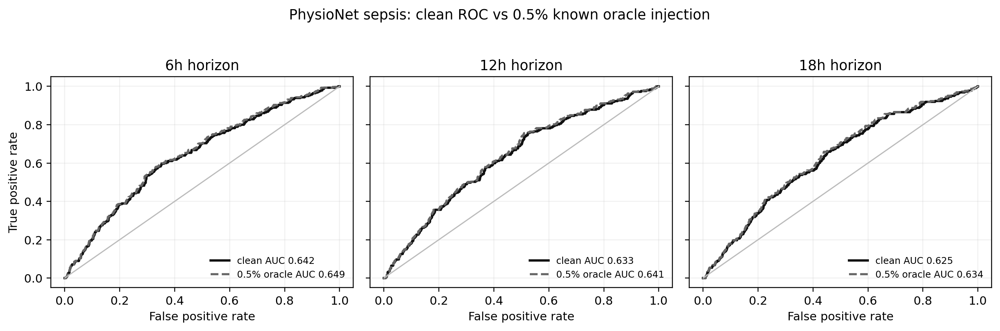

# LAMP: Latent-state Audit with Matched-cohort Protocol

**An executable failure-mode audit for hidden-state monitors.**

LAMP tests whether a model that claims to detect a future, hidden, or latent
state is actually using the information it is allowed to use. It takes a
time-series prediction table plus a YAML audit contract and returns a
machine-readable dossier separating valid early signal from leakage, shortcuts,
and label-adjacent contamination.

The central result is **metric-blind leakage**: a monitor can keep almost the
same AUC while its information contract is already broken. In other words,
performance can look normal while validity has failed.


## Core Result

On real PhysioNet/CinC 2019 sepsis rows, LAMP injects a known oracle-label
component into the score:

```text
mixed_score = z((1 - lambda) * z(valid_score) + lambda * z(oracle_score))
```

At 0.5% oracle injection, AUC changes by less than a simple 0.01 metric alert
across all horizons, but LAMP fails the monitor because the information contract
is broken.

| Horizon | Clean AUC | 0.5% Oracle AUC | Delta AUC | AUC Alert >= 0.01 | LAMP |
| --- | ---: | ---: | ---: | :---: | --- |
| 6h | 0.6416 | 0.6494 | 0.0078 | No | FAIL |
| 12h | 0.6328 | 0.6411 | 0.0083 | No | FAIL |
| 18h | 0.6249 | 0.6336 | 0.0087 | No | FAIL |

Clean-vs-0.5% known-truth classification gives sensitivity 1.000 and
specificity 1.000 in both strict-declared and geometry-only audit modes.

See
`results/physionet_sepsis_oracle_injection/real_physionet_oracle_injection_report.md`
and `results/physionet_sepsis_oracle_injection/figures/`.



## What LAMP Audits

LAMP is built around an explicit **information contract**:

> At prediction time, what information is the monitor allowed to know?

Given that contract, LAMP checks:

- Temporal isolation
- Forbidden feature screening
- Negative controls and permutation tests
- Matched observed-state cohorts
- Leaky sentinel predictors
- Early-window sensitivity
- Threshold robustness
- Score-direction sanity checks

The output dossier assigns failure-mode classes such as:

- `audit_pass_candidate`
- `null_or_destroyed_signal`
- `valid_early_hidden_state_signal`
- `visible_state_confounding`
- `future_physiology_invalid_comparator`
- `oracle_label_leakage_sentinel`
- `oracle_leakage_proximity_shift`
- `forbidden_feature_contamination`
- `threshold_fragile_claim`

Passing LAMP does not prove clinical, biological, or alignment validity. It
means the monitor survived the configured failure-mode audit and earned the
right to further, more expensive evaluation.

## Evidence

### Real Clinical Early Warning

- **PhysioNet/CinC 2019 sepsis v3_5k**: external ICU early-warning benchmark
  with horizons 6h, 12h, and 18h.
- Raw `.psv` sequence pipeline with early/future splits, trend features,
  missingness features, MLP probes, and optional LSTM/GRU/Transformer monitors.
- Classical and neural monitors show the expected separation: valid early
  models can pass, while future-window and oracle-contaminated variants fail.
- Known-truth 0.5% oracle injection on real sepsis rows reproduces the
  metric-blind leakage pattern.

Key reports:

- `results/physionet_sepsis_oracle_injection/real_physionet_oracle_injection_report.md`
- `results/physionet_sequence_lamp/physionet_sequence_lamp_report.md`
- `results/sepsis_ml_lamp/sepsis_ml_lamp_report.md`
- `notebooks/cinc2019_lamp_neural_audit.ipynb`

### Physical Degradation Control

NASA C-MAPSS FD001 provides a physical run-to-failure benchmark. Valid
current-cycle degradation monitors pass, while tiny true-RUL oracle
contamination moves AUC by only 0.0004 and is not significant by incremental MI
bootstrap (p=0.096), yet fails the information-contract audit.

See `results/cmapss_lamp/cmapss_lamp_report.md`.

### LLM And AI-Safety Audits

LAMP also applies to AI monitoring settings where hidden-state claims are
common:

- Anthropic `model-written-evals` sycophancy data: prompt-only monitors pass,
  answer-key leakage fails, low-dose answer-key mixtures fail.
- LLM-safety toy battery: latent knowledge, hidden-state probes, deceptive
  behavior, chain-of-thought leakage, routing signals, and low-dose oracle
  contamination.
- Eval-awareness / sandbagging-style framing battery: separates valid framing
  sensitivity from answer-key, rubric, stage-token, and surface-behavior
  shortcuts.
- ScaleAI/MRT micro audit: a small public agent-monitoring artifact with
  score-direction ambiguity explicitly reported.

Key reports:

- `results/anthropic_sycophancy_lamp/anthropic_sycophancy_lamp_report.md`
- `results/llm_safety_lamp/llm_safety_lamp_report.md`
- `results/eval_awareness_lamp/eval_awareness_lamp_report.md`
- `results/mrt_lamp_micro/mrt_lamp_micro_report.md`

### Biological And Pharmacology Extensions

LAMP-Bio turns iPSC maturation claims into auditable contracts: which biological
axis defines the endpoint, which disjoint axis is allowed as evidence, and which
protocol, donor, timepoint, or endpoint-adjacent features are forbidden.

Current artifacts include:

- GEO `GSE201437`: clean disjoint maturation probe PASS (AUC 0.694),
  high-calcium protocol shortcut FAIL (AUC 0.857), oracle leakage FAIL
  (AUC 1.000), with robustness analysis.
- GEO `GSE209997`: iPSC-CM maturation micro-audit separating maturation markers
  from timepoint and 3D-protocol shortcuts.
- Synthetic kinase/protein-folding molecular-code control: clean early
  kinase/proteostasis monitor PASS (AUC 0.914), 0.5% oracle contamination moves
  AUC only from 0.914 to 0.916 while failing the declared information contract.
- LAMP-Pharm `GSE114686`: asks whether hiPSC-CM cardiotoxicity monitors detect
  pharmacological biology or drug/dose experimental structure.

Key reports:

- `results/ipsc_cm_maturation_lamp/gse201437_protocol_shortcut/gse201437_protocol_shortcut_lamp_report.md`
- `results/ipsc_cm_maturation_lamp/bio_contract_diagnosis/ipsc_cm_bio_contract_diagnosis.md`
- `results/ipsc_molecular_code/synthetic_kinase_folding/synthetic_ipsc_molecular_code_report.md`
- `results/ipsc_molecular_code/synthetic_kinase_folding/leakage_sensitivity/ipsc_molecular_code_leakage_analysis_report.md`
- `results/lamp_pharm/gse114686_tki_cardiotoxicity/gse114686_lamp_pharm_report.md`

### Mechanistic Testbeds

IRIS remains a controlled mechanistic demonstration, not the main selling
point. It provides a toy latent-reserve system for checking whether LAMP
separates valid latent signal from visible confounding, future leakage, oracle
leakage, and threshold fragility under controlled dynamics.

## Quick Start

```bash
pip install -e .

# Main real-data known-truth leakage control
python scripts/run_physionet_sepsis_oracle_injection_analysis.py

# Controlled synthetic metric-blind leakage experiment
python scripts/run_metric_blind_leakage_control.py

# NASA C-MAPSS physical degradation benchmark
python scripts/run_cmapss_lamp_bench.py

# Real clinical ML benchmark on exported sepsis feature tables
python scripts/run_sepsis_ml_lamp_bench.py

# Raw PhysioNet/CinC 2019 PSV sequence benchmark
python scripts/run_physionet_sequence_lamp_bench.py --max-patients 3000

# Optional neural/classical benchmark models
pip install -e ".[benchmarks]"
python scripts/run_physionet_sequence_lamp_bench.py --max-patients 8000 --horizons 6,12,18 --early-window 12 --epochs 4

# Public real LLM-evaluation dataset benchmark
python scripts/run_anthropic_sycophancy_lamp_bench.py

# LLM-safety toy battery
python scripts/run_llm_safety_lamp_bench.py

# iPSC-CM biological contract diagnosis
python scripts/run_ipsc_cm_bio_contract_diagnosis.py

# Run a small bundled audit
lamp audit --config examples/synthetic/config.yaml --data examples/synthetic/input.csv --output audit_results/
```

If the `lamp` entry point is not on `PATH`, use:

```bash
python -m lamp.cli audit --config examples/synthetic/config.yaml --data examples/synthetic/input.csv --output audit_results/
```

## Repository Structure

```text
src/lamp/
  audit.py       # LAMP_Audit orchestration
  controls.py    # temporal, forbidden-feature, negative-control checks
  matching.py    # matched observed-state cohorts
  sentinels.py   # leaky sentinel and proximity diagnostics
  reports.py     # JSON/Markdown outputs
  cli.py         # command-line entry points

scripts/         # reproducible benchmark and artifact builders
configs/         # audit contracts
examples/        # minimal input/config examples
results/         # committed compact audit artifacts
notebooks/       # walkthrough notebooks
paper/           # preprint draft and figures
docs/            # protocol and domain-contract notes
```

## Alignment Relevance

The alignment use case is the same information-contract problem in a different
domain: can a monitor detect latent knowledge, situational awareness, deceptive
behavior, hidden goals, or capability drift before these become visible, without
using answer keys, rubric cues, chain-of-thought traces, routing metadata, or
post-hoc labels?

Current alignment-facing directions:

- Matched-behavior latent knowledge audits
- Deceptive-alignment early-warning benchmarks
- Scalable oversight leakage atlas
- Capability reserve-collapse monitoring in agent runs

## Preprint

See `paper/metric_blind_leakage_preprint.md`.

Working title:

**Metric-Blind Leakage: A Structural Failure Mode in Hidden-State Monitor
Validation**

## Status

Active pre-submission research. Open to collaboration and extensions.
