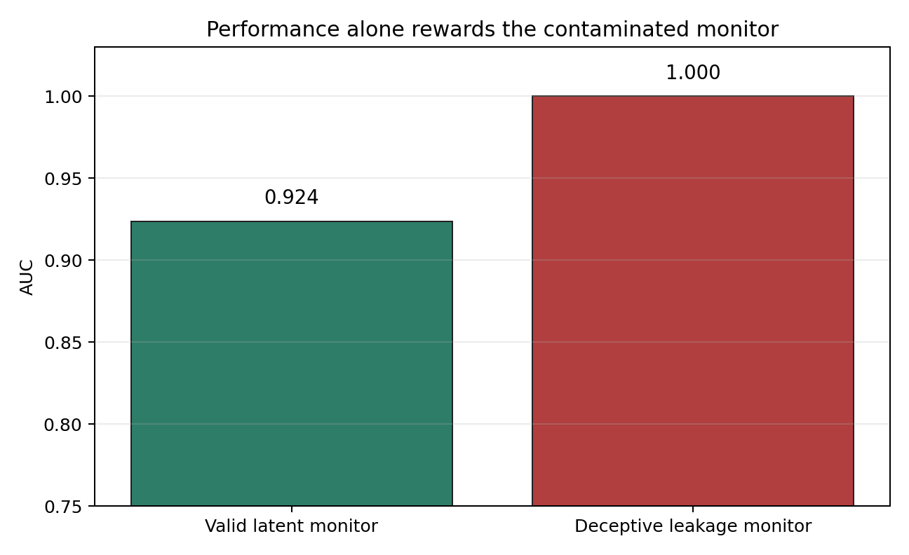
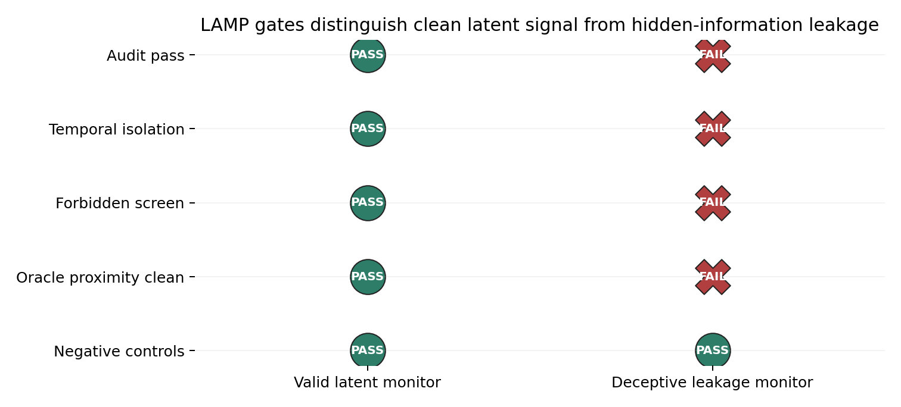
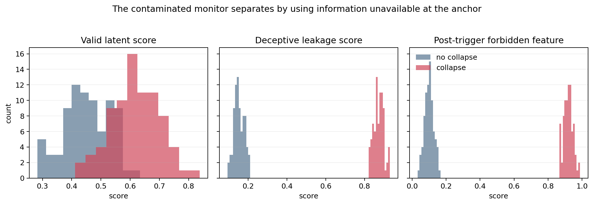

# Synthetic Deception Demo

This demo translates LAMP into an alignment-style setting. Agents are matched on visible pre-trigger behavior, but some later undergo a reserve-collapse-like failure. The clean monitor uses pre-trigger latent signal; the deceptive monitor looks better because it uses a post-trigger hidden-information shortcut.

## Headline

| monitor | AUC | audit pass | temporal isolation | forbidden screen | oracle leakage proximity | interpretation |
|---|---:|:---:|:---:|:---:|:---:|---|
| valid latent monitor | 0.924 | True | True | True | False | clean early latent signal |
| deceptive leakage monitor | 1.000 | False | False | False | True | hidden-information leakage |

LAMP separates the valid latent monitor (AUC 0.92, clean audit, audit_pass) from the deceptive leakage monitor (AUC 1.0, but multiple clear failures: temporal isolation, forbidden-feature screening, and oracle-leakage proximity). This directly illustrates detection of evaluation gaming / hidden information.







## Reproduce

```powershell
python scripts/run_synthetic_deception_experiment.py
lamp audit --config examples/alignment_deception/deceptive_leakage_config.yaml --data examples/alignment_deception/input.csv --output examples/alignment_deception/deceptive_leakage_lamp
```
