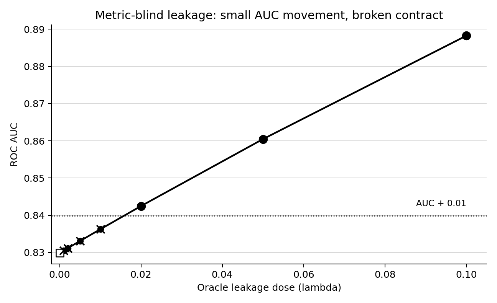

# Metric-Blind Leakage: A Structural Failure Mode in Hidden-State Monitor Validation

## Abstract

Hidden-state monitors are usually validated with discrimination metrics such as ROC AUC, but these metrics measure ranking performance rather than whether the score was allowed to know the information that produced that ranking. We show, across clinical early warning, LLM-evaluation data, a physical run-to-failure benchmark, and a controlled synthetic perturbation, that small oracle contamination can leave AUC and incremental mutual-information tests apparently unremarkable while already violating the monitor's information contract. This failure mode, which we call metric-blind leakage, implies that hidden-state monitor validation must audit information boundaries directly rather than relying on performance changes alone.

## 1. Introduction

Many high-stakes monitoring systems are evaluated by asking whether a score discriminates future events from non-events. In biomedical early warning this often means ROC AUC for future sepsis, deterioration, or intervention. In AI-safety evaluation it may mean whether a probe or behavioral monitor predicts latent knowledge, evaluation awareness, deceptive behavior, or hidden goal state. In engineering prognostics it may mean whether a model ranks systems by impending failure. Across these settings, AUC has become a convenient validation currency because it is threshold-free, easy to compare, and robust to calibration choices.

But AUC answers a narrower question than hidden-state validation requires. It measures whether positives tend to receive higher scores than negatives. It does not ask whether the score used only information available at the claimed prediction time, whether it relied on future physiology or later degradation state, whether it encoded answer-key metadata, or whether a small amount of privileged information entered the score definition. A score can therefore preserve nearly the same AUC while changing what kind of epistemic object it is.

This paper studies that gap. The central claim is: **standard metric validation can be nearly unchanged while hidden-state validity has already failed.**

## 2. The Failure Mode

Let \(Y\) be a future or hidden-state label, \(X_{\leq t}\) the allowed information at prediction time \(t\), and \(Z\) an oracle or post-anchor variable that is not allowed under the monitor's information contract. A valid hidden-state monitor is a score

\[
s_0 = f(X_{\leq t}).
\]

An oracle-contaminated monitor can be written as

\[
s_\lambda = (1-\lambda)s_0 + \lambda g(Z),
\]

where \(0 < \lambda \ll 1\). If \(\lambda\) is small, the ranking induced by \(s_\lambda\) may be almost identical to the ranking induced by \(s_0\). Consequently,

\[
\Delta \mathrm{AUC} = \mathrm{AUC}(s_\lambda, Y) - \mathrm{AUC}(s_0, Y)
\]

can be smaller than ordinary run-to-run variation, bootstrap uncertainty, or a conventional alert threshold. The monitor is nevertheless invalid for the original claim, because \(s_\lambda\) is no longer a function only of \(X_{\leq t}\).

This is not a bad choice of AUC threshold. It is a structural mismatch. AUC is a rank-discrimination statistic; the failure is an information-boundary violation. AUC can be stable because the score order barely changes, while the causal and temporal provenance of the score has changed completely.

We call this failure mode **metric-blind leakage**: contamination that is too small to be reliably detected by ordinary performance deltas, but already invalidates the hidden-state claim.

## 3. LAMP Audit Protocol

LAMP, Latent-state Audit with Matched-cohort Protocol, is an executable audit protocol for hidden-state monitor claims. It takes a prediction table and a YAML audit specification, then returns a machine-readable failure-mode dossier.

The protocol is not a replacement for prospective validation. It is a pre-validation screen for information validity. In this paper we use the following LAMP components:

- Temporal isolation: whether the declared score features are available at or before the anchor time.
- Forbidden-feature screening: whether oracle, post-anchor, answer-key, or future-window variables enter the valid score definition.
- Negative controls: whether noise, score permutation, and label permutation behave near null.
- Matched observed-state cohorts: whether signal survives matching on visible state or collapses as a shortcut.
- Sentinel predictors: whether future or oracle comparators behave as expected.
- Leakage proximity: whether a contaminated score moves toward an oracle sentinel.
- Threshold robustness: whether conclusions depend on fragile score thresholds.

The important distinction is that LAMP audits the information contract, not only the metric. A monitor can have a high AUC and still fail if its score uses information outside the declared boundary.

## 4. Experiments

We test metric-blind leakage in four settings. Three are real benchmark domains: PhysioNet/CinC 2019 sepsis early warning, Anthropic model-written-evals sycophancy data, and NASA C-MAPSS FD001 turbofan degradation. The fourth is a controlled synthetic perturbation where the data-generating process and leakage dose are exactly known.

In each benchmark, we start from a valid monitor \(s_0\), construct a low-dose oracle mixture at \(\lambda = 0.001\), and compare three diagnostics: AUC-delta alert, incremental mutual information, and LAMP decision. The AUC alert threshold is \(|\Delta \mathrm{AUC}| \geq 0.01\). The MI test is a paired bootstrap test on incremental binned mutual information, comparing \(I(s_\lambda;Y)\) against \(I(s_0;Y)\).

| Domain | Valid monitor | Valid AUC | AUC at lambda=0.001 | Delta AUC | AUC alert | Incremental MI significant | LAMP decision |
|---|---|---:|---:|---:|:---:|:---:|---|
| PhysioNet/CinC 2019 sepsis | RF early-window monitor | 0.8188 | 0.8198 | 0.0009 | No | No (p=0.322) | FAIL |
| Anthropic sycophancy eval | TF-IDF prompt-only monitor | 0.9873 | 0.9874 | 0.0001 | No | No (p=0.266) | FAIL |
| NASA C-MAPSS FD001 | HGB current-cycle degradation monitor | 0.9017 | 0.9021 | 0.0004 | No | No (p=0.096) | FAIL |

The table shows the key pattern. At the same low contamination dose, AUC does not move enough to trigger a simple metric-delta screen, incremental MI is not significant, and LAMP still rejects the monitor because the information contract is broken.

### PhysioNet/CinC 2019 Sepsis

The clinical benchmark uses held-out PhysioNet/CinC 2019 sepsis prediction rows from the LAMP raw sequence audit. The valid monitor is a random-forest early-window model with AUC 0.8188. Adding 0.1% oracle label sentinel score raises AUC to only 0.8198, a change of 0.0009. AUC-delta and incremental MI do not flag the difference, but LAMP fails temporal isolation and forbidden-feature checks because the mixed score now declares oracle information.

### Anthropic Sycophancy Evaluation Data

The LLM-evaluation benchmark uses Anthropic's public model-written-evals sycophancy data. The valid monitor is a prompt-only TF-IDF classifier with AUC 0.9873. Adding 0.1% answer-key oracle score raises AUC to 0.9874, a change of 0.0001. The incremental MI bootstrap is non-significant. LAMP fails the monitor because answer-key information is outside the allowed prompt-only information boundary.

### NASA C-MAPSS FD001

C-MAPSS is a physical hidden-degradation benchmark. Each engine has a run-to-failure trajectory and verified remaining useful life (RUL). The valid monitor predicts whether an engine is within 120 cycles of failure using current-cycle operational and sensor channels. A HistGradientBoosting monitor passes LAMP with AUC 0.9017; a random forest current-cycle monitor also passes with AUC 0.9068. A 0.1% true-RUL oracle mixture changes AUC by only 0.0004 and has non-significant incremental MI (p=0.096), but LAMP fails because true RUL is not available under the declared current-cycle information contract.

### Synthetic Dose-Control Experiment

The synthetic control fixes the population, valid score, and oracle score, then varies the oracle mixture dose \(\lambda\). Baseline valid AUC is 0.8299. At \(\lambda=0.001\), AUC is 0.8305 (Delta AUC=0.0006). At \(\lambda=0.005\), AUC is 0.8331 (Delta AUC=0.0032). AUC-delta remains below 0.01, while LAMP fails at the first nonzero oracle dose because the declared score definition now includes forbidden oracle information.

## 5. Comparison With Standard Tests

The sharpest comparison is the C-MAPSS lambda=0.001 row. AUC-delta is false: Delta AUC is only 0.0004. Incremental MI is false: Delta MI is 0.0012 nats, 95% CI -0.0001 to 0.0035, p=0.096. LAMP is false: the score fails because true RUL entered a monitor that claimed to use only current-cycle information.

This demonstrates the core mechanism. Standard tests ask whether the contaminated score is detectably more predictive. LAMP asks whether the contaminated score is still the same kind of valid object. A score can remain metrically ordinary while becoming epistemically invalid.

The same pattern appears in PhysioNet and sycophancy data. In PhysioNet, RF AUC changes by 0.0009 at lambda=0.001; in Anthropic sycophancy, TF-IDF AUC changes by 0.0001. Neither produces a significant incremental MI result, but both violate their declared information boundary. This is why metric-blind leakage is not merely a tuning issue. It is a category error in validation logic.

## 6. Limitations

First, the oracle-mixture construction is deliberately controlled. It demonstrates that a small amount of forbidden information can be invisible to standard metric screens, but it does not cover every real leakage mechanism. Real systems may leak through preprocessing, sampling, missingness, split construction, repeated subjects, cached labels, chain-of-thought traces, routing metadata, or deployment workflow variables.

Second, LAMP depends on a declared information contract. If the analyst declares the wrong boundary, the audit can only test that boundary. This is a strength and a limitation: LAMP makes the hidden assumption explicit, but it does not discover the intended scientific claim by itself.

Third, C-MAPSS and synthetic controls make oracle information cleanly available. Some real LLM and biomedical tasks have messier labels, ambiguous anchors, or uncertain prospective definitions. A natural next case is a Vestige-EN-style text evaluation setting, where answer keys, rubric traces, evaluator metadata, and visible response behavior may all be partially entangled. Such settings are exactly where information-contract auditing is needed, but they require careful task-specific boundary definitions.

Finally, passing LAMP is not proof of deployment validity. It means the monitor survived the configured failure-mode audit and earned the right to more expensive prospective testing.

## 7. Conclusion

Hidden-state monitor validation should not rely on performance metrics alone. AUC is useful for ranking, but it is blind to the provenance of the information that produced the ranking. We show that small oracle contamination can leave AUC and incremental MI tests apparently normal while already invalidating the hidden-state claim.

The practical implication is simple: hidden-state monitors need information-contract audits. Before asking whether a monitor performs well, validation should ask whether it was allowed to know what made it perform well.

