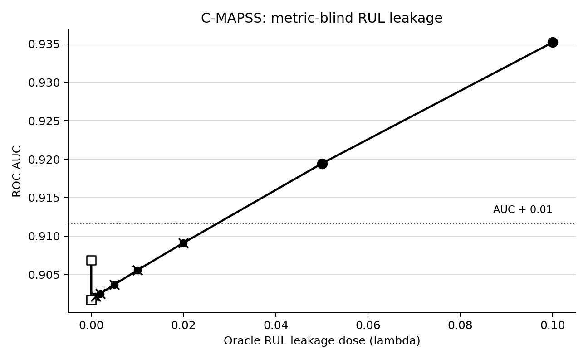

# NASA C-MAPSS LAMP Benchmark

This benchmark applies LAMP to NASA C-MAPSS FD001 as a physical
hidden-degradation task. The valid monitor predicts whether an engine is
within 120 cycles of failure using only current-cycle
operational and sensor channels. Oracle mixtures inject true RUL-derived
information at controlled low doses.

## Dataset

- Source: NASA Prognostics Center of Excellence C-MAPSS turbofan simulation
- Train examples: 5600 rows across 70 engines
- Held-out examples: 2400 rows across 30 engines
- Positive label: RUL <= 120 cycles

## Key Result

Valid current-cycle AUC is 0.9017. At lambda=0.001, AUC is 0.9021 (delta=0.0004), below the 0.01 AUC-delta alert. The incremental MI test is also not significant at alpha=0.05 (delta MI=0.0012 nats, 95% CI -0.0001 to 0.0035, p=0.096). LAMP still rejects the monitor because the score now violates the declared RUL information boundary.

This is metric-blind leakage in a physically interpretable degradation system:
standard discrimination barely moves, but the validity claim has already changed.

## Audit Summary

| monitor | lambda | AUC | delta AUC | AUC alert | delta MI | MI p | MI sig | LAMP pass | temporal | forbidden | oracle proximity | oracle alert |
|---|---:|---:|---:|:---:|---:|---:|:---:|:---:|:---:|:---:|---:|:---:|
| valid_hgb | 0.0 | 0.9017 | 0.0000 | False | 0.0000 | 1.0000 | False | True | True | True | 0.0000 | False |
| rf_valid | 0.0 | 0.9068 | 0.0051 | False | NA | NA | NA | True | True | True | 0.0000 | False |
| future_rul_leaky | NA | 1.0000 | 0.0983 | True | NA | NA | NA | False | False | False | 1.0000 | True |
| oracle_mix_0p0 | 0.0 | 0.9017 | 0.0000 | False | 0.0000 | 1.0000 | False | True | True | True | 0.0000 | False |
| oracle_mix_0p001 | 0.001 | 0.9021 | 0.0004 | False | 0.0012 | 0.0963 | False | False | False | False | 0.0041 | False |
| oracle_mix_0p002 | 0.002 | 0.9025 | 0.0008 | False | 0.0023 | 0.0166 | True | False | False | False | 0.0081 | False |
| oracle_mix_0p005 | 0.005 | 0.9037 | 0.0020 | False | 0.0057 | 0.0033 | True | False | False | False | 0.0199 | True |
| oracle_mix_0p01 | 0.01 | 0.9056 | 0.0038 | False | 0.0088 | 0.0033 | True | False | False | False | 0.0390 | True |
| oracle_mix_0p02 | 0.02 | 0.9091 | 0.0074 | False | 0.0163 | 0.0033 | True | False | False | False | 0.0752 | True |
| oracle_mix_0p05 | 0.05 | 0.9194 | 0.0177 | True | 0.0389 | 0.0033 | True | False | False | False | 0.1803 | True |
| oracle_mix_0p1 | 0.1 | 0.9352 | 0.0335 | True | 0.0765 | 0.0033 | True | False | False | False | 0.3407 | True |

## Interpretation

C-MAPSS makes the information contract physically legible: RUL is a verified
run-to-failure quantity, while current-cycle sensors are the allowed monitor
view. A low-dose RUL oracle can leave AUC and incremental-MI screens below
conventional significance while still invalidating the hidden-degradation claim.

