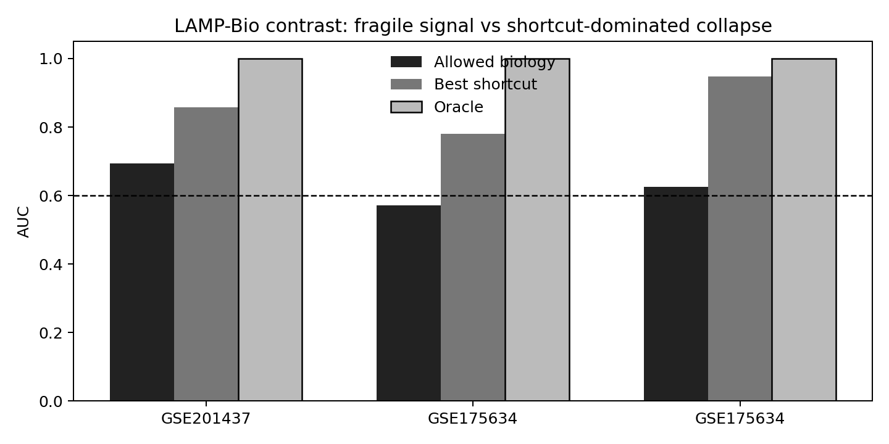

# LAMP-Bio Cross-Dataset Contrast: GSE201437 vs GSE175634

The interesting question is no longer `where does LAMP find PASS?`.
The stronger question is why one iPSC-CM dataset admits a fragile
disjoint biological signal while another collapses under a stricter
single-cell count-matrix contract.

## Main Contrast

| Dataset | Resolution | Allowed biology AUC | Best shortcut AUC | Oracle AUC | Diagnosis |
| --- | --- | ---: | ---: | ---: | --- |
| GSE201437 | sample-level processed expression | 0.694 | 0.857 | 1.000 | valid_biological_signal_fragile |
| GSE175634 | cell-level scRNA counts | 0.571 | 0.781 | 1.000 | not_biologically_interpretable_under_contract |
| GSE175634 | sample pseudo-bulk scRNA | 0.626 | 0.947 | 1.000 | fragile_pseudobulk_rescue |

## Dataset-Level Reading

- **GSE201437**: A clean disjoint calcium/electrophysiology probe can pass, but stability is weak and HCRP leave-out collapses. bootstrap PASS rate 0.503; leave-group min AUC 0.524.
- **GSE175634**: Disjoint calcium/metabolic axes collapse under the strict single-cell contract, while day and pseudotime remain predictive. allowed bootstrap PASS rate 0.000; leave-individual min AUC 0.552.
- **GSE175634 pseudo-bulk**: Aggregation partially rescues the calcium/electrophysiology axis, but the rescue is fragile and forbidden annotation/pseudotime channels strengthen more. bootstrap PASS rate 0.603; leave-individual min AUC 0.542.

The contrast is the result. LAMP is not mechanically saying all biology
fails, and it is not rewarding every high-AUC biological score. It separates
a small fragile sample-level signal, a cell-level scRNA collapse, and a
partial pseudo-bulk rescue where shortcut/trajectory channels strengthen
even more than the allowed biology axis.

## Why Published Annotation AUC 0.654 Matters

The published CM annotation in GSE175634 is predictive but far from an oracle
for the strict structural endpoint. That means at least one of three things
is true: the annotation is not identical to structural maturation, the
structural endpoint is narrower than the cell-type label, or the dataset
contains many transitional cells. All three interpretations are biologically
interesting and argue against treating annotation, pseudotime, or day as
clean latent-state evidence.

## Working Formulation

> In a large real-world hiPSC differentiation dataset, independent biological
> axes failed at cell level but showed a fragile calcium/electrophysiology
> pseudo-bulk rescue. Temporal, annotation, and trajectory-derived channels
> strengthened more than the allowed biology axis. This suggests that
> apparent maturation performance can be dominated by timepoint and
> reconstruction structure even when some independent biology is recoverable
> after aggregation.

## Hypotheses

| Hypothesis | Evidence now | Next test | Status |
| --- | --- | --- | --- |
| A_marker_panels_are_bad | Possible, but not sufficient: the calcium/electrophysiology panel supports a fragile signal in GSE201437 and all selected marker genes are present in GSE175634. | Repeat with alternative curated panels and data-driven disjoint gene modules learned without endpoint genes. | open_but_not_primary |
| B_stage_specific_axis_decoupling | Plausible: GSE175634 pilot covers early/intermediate single-cell states where structural markers may rise before calcium/metabolic maturation becomes coordinated. | Run day-stratified and late-day-only audits; test structural->calcium and metabolic endpoint reversals. | strong_candidate |
| C_single_cell_noise_collapses_cross_axis_signal | Strengthened: calcium/electrophysiology rises from cell-level AUC 0.571 to pseudo-bulk AUC 0.626, but the rescue is fragile (bootstrap pass rate about 0.60; leave-individual min AUC 0.542). | Run donor/collection-held-out pseudo-bulk and compare sample-level, collection-level, and annotation-free aggregation contracts. | strong_candidate |
| D_time_and_trajectory_channels_dominate | Strong: in GSE175634, day and pseudotime beat all allowed biology panels at cell level, and pseudo-bulk aggregation strengthens forbidden channels even more (pseudotime AUC 0.942; annotation AUC 0.947). | Evaluate day-held-out, pseudotime-withheld, and reconstruction-free contracts across additional scRNA maturation datasets. | strong_candidate |

## Figure

## Files

- Summary CSV: `results/lamp_bio_cross_dataset_contrast/gse201437_vs_gse175634_contrast_summary.csv`
- Hypotheses CSV: `results/lamp_bio_cross_dataset_contrast/gse201437_vs_gse175634_hypotheses.csv`
- Figure: `results/lamp_bio_cross_dataset_contrast/figures/allowed_biology_vs_shortcut_auc.png`
