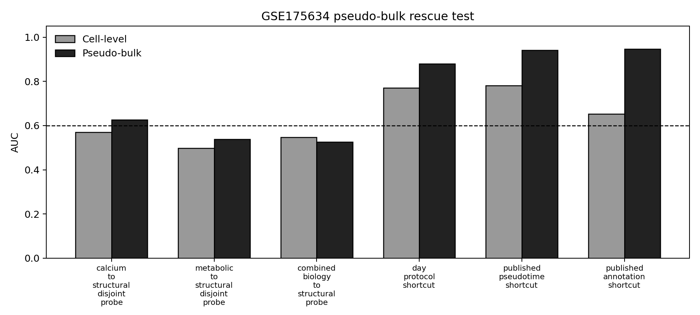

# GSE175634 Pseudo-Bulk Rescue Audit

This test distinguishes two explanations for the GSE175634 cell-level
collapse: single-cell noise versus a deeper lack of independent
cross-axis support under the current structural endpoint contract.

## Setup

- Source: `GSE175634` (https://www.ncbi.nlm.nih.gov/geo/query/acc.cgi?acc=GSE175634)
- Cell rows aggregated: 60,000.
- Pseudo-bulk groups: 28 grouped by `sample`.
- Cells per group: min 434, median 2037.5, max 6146.
- Endpoint-positive pseudo-bulk groups: 9 / 28.

## Cell-Level vs Pseudo-Bulk

| Monitor | Cell AUC | Pseudo-bulk AUC | Gain | Diagnosis | Bootstrap pass | Leave-individual min AUC |
| --- | ---: | ---: | ---: | --- | ---: | ---: |
| Pseudo-bulk calcium/ephys -> structural endpoint | 0.571 | 0.626 | +0.055 | fragile_pseudobulk_rescue | 0.603 | 0.542 |
| Pseudo-bulk metabolic -> structural endpoint | 0.497 | 0.538 | +0.041 | no_pseudobulk_rescue | 0.321 | 0.467 |
| Pseudo-bulk combined biology -> structural endpoint | 0.548 | 0.526 | -0.022 | no_pseudobulk_rescue | 0.320 | 0.442 |
| Pseudo-bulk day shortcut | 0.771 | 0.880 | +0.109 | forbidden_shortcut_strengthened_by_pseudobulk | 1.000 | 0.853 |
| Pseudo-bulk pseudotime shortcut | 0.781 | 0.942 | +0.161 | forbidden_shortcut_strengthened_by_pseudobulk | 1.000 | 0.920 |
| Pseudo-bulk annotation shortcut | 0.654 | 0.947 | +0.294 | forbidden_shortcut_strengthened_by_pseudobulk | 1.000 | 0.929 |

## Interpretation

The calcium/electrophysiology axis shows a **fragile pseudo-bulk rescue**:
cell-level AUC 0.571 rises to pseudo-bulk AUC 0.626. That supports the
single-cell-noise hypothesis, but only weakly: bootstrap pass rate is
about 0.59 and leave-one-individual minimum AUC is 0.542.

The rescue is not a clean biological validation. Pseudotime, annotation,
and day/protocol channels remain stronger than the allowed biology axis.
The careful claim is therefore: aggregation partially rescues one
independent biological axis, but the current GSE175634 structural endpoint
is still dominated by shortcut/trajectory structure under this contract.

## Decision Logic

- `cell-level FAIL -> pseudo-bulk fragile rescue`: single-cell noise is a
  plausible contributor.
- The weak stability means this is not yet `valid_biological_signal_stable`.
- The next decisive test is donor/collection-held-out pseudo-bulk with
  alternative endpoint axes and day-held-out splits.

## Figure

## Files

- Prediction table: `results/lamp_bio_scrna/gse175634_pseudobulk_rescue/gse175634_pseudobulk_prediction_table.csv`
- Summary CSV: `results/lamp_bio_scrna/gse175634_pseudobulk_rescue/gse175634_pseudobulk_rescue_summary.csv`
- Inventory: `results/lamp_bio_scrna/gse175634_pseudobulk_rescue/gse175634_pseudobulk_rescue_inventory.json`
